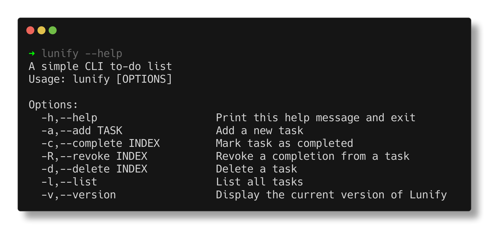
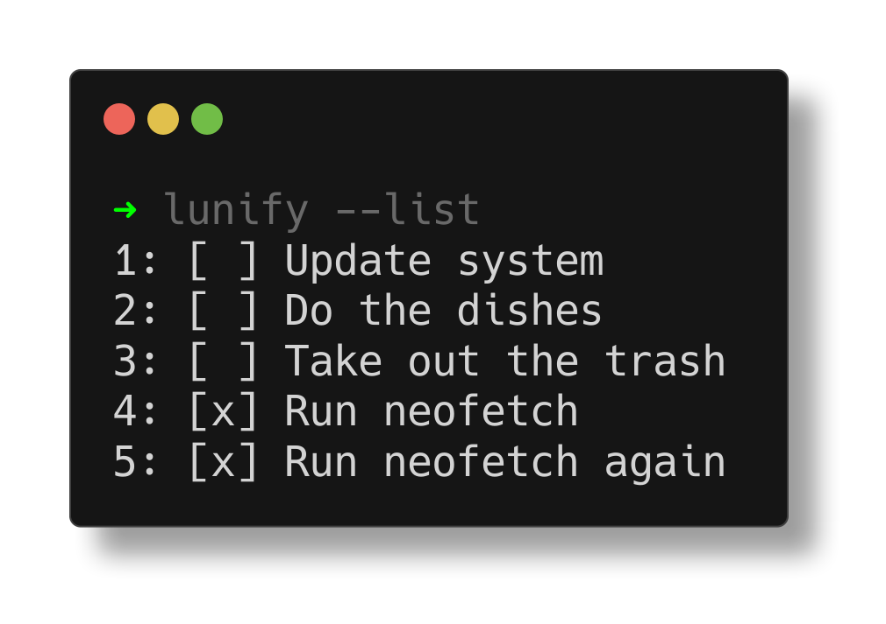

# Lunify 🌙
A simple CLI to-do list application for Linux.

Quickly manage your tasks from the terminal!




---

# Installation Instructions
Download the package from release.\
Then make it executable and move it to a valid path:
```bash
chmod +x lunify
sudo mv lunify /usr/local/bin
```
**Note**: You don't have to move it to /usr/local/bin (although it's recommended), just a valid exported path.
## Build locally
**DISCLAIMER**: Make sure you have the [nholmann/json](https://github.com/nlohmann/json) library installed on your system.
Clone the repo:
```bash
git clone https://github.com/rexept/lunify
```
Make the build directory:
```bash
cd lunify
mkdir build
cd build
```
Initialize and run CMake:
```bash
cmake -DCMAKE_BUILD_TYPE=Release ..
make
```
Install globally (requires sudo):
```bash
sudo make install
```

# Build Instructions (for development)
Clone the repo:
```bash
git clone https://github.com/rexept/lunify
```
Make the build directory:
```bash
cd lunify
mkdir build
cd build
```
Initialize CMake
```bash
cmake -DCMAKE_BUILD_TYPE=Debug -DCMAKE_EXPORT_COMPILE_COMMANDS=ON .. 
```
---

Special thanks to [termshot](https://github.com/homeport/termshot) for the amazing screenshots
